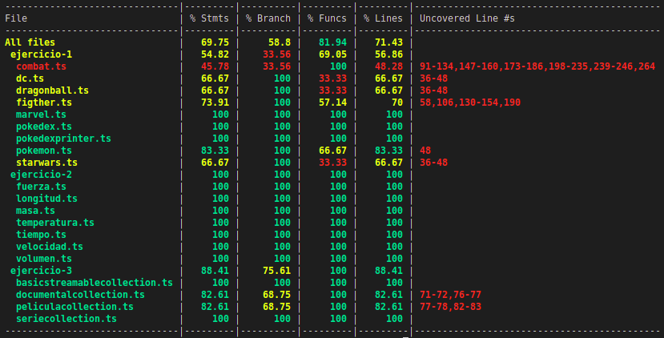
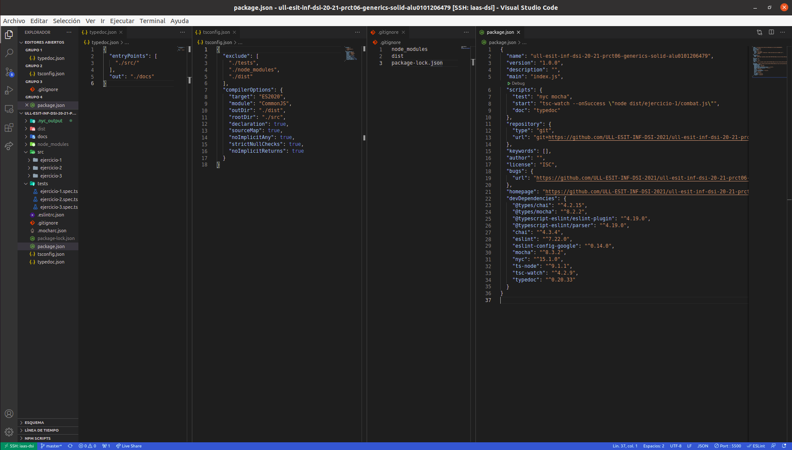

# Informe
## Práctica 6 - Clases e interfaces genéricas. Principios SOLID
### Desarrollo de Sistemas Informáticos
### ACOIDAN MESA HERNANDEZ - alu0101206479@ull.edu.es

#### Introducción
Esto es un informe para poder llevar a cabo la **práctica 6 de Desarrollo de Sistemas Informáticos**, hemos vuelto a crear una estructura de directorios adecuada (algo que ya sabíamos de prácticas anteriores), añadiendole el uso del generador de documentación [TypeDoc](https://typedoc.org/) y el uso de [Mocha](https://mochajs.org/) (Marco de pruebas rico en funciones) con [Chai](https://www.chaijs.com/) (Librería de aserciones BDD / TDD para node y el navegador que se puede combinar con cualquier marco de pruebas JS o TS, en este caso lo hemos configurado con Mocha). También hemos añadido [Instanbul](https://istanbul.js.org/) (Una herramienta que permite obtener informes sobre el cubrimiento del código fuente llevado a cabo por las pruebas que haya diseñado)

A parte, como se ha llevado a cabo la metodología **TDD**, hemos reforzado nuestros conocimientos sobre ello una vez más. Y también hemos aprendido a utilizar **las clases e interfaces genéricas** y a aplicar los **principios SOLID**. En este informe se mostrarán la resolución de los ejercicios y la explicación de estas soluciónes.

También cabe destacar que hemos aprendido a usar los [issues de Github](https://guides.github.com/features/issues/), ya que era por dónde único podríamos comunicarle al profesorado cualquier tipo de incidencia relacionada con la práctica.

#### Objetivos
Los objetivos de esta práctica han sido crear la estructura de directorios adecuada para trabajar, añadiendole el generador de documentación TypeDoc, el uso del marco de pruebas Mocha con la libreria Chai y Instanbul para obtener un informe de cubrimiento de nuestro código cada vez que ejecutasemos las pruebas. Pero lo principal ha sido resolver los 3 ejercicios que nos planteaban en el [enunciado](https://ull-esit-inf-dsi-2021.github.io/prct06-generics-solid/), para así familiarizarnos más profundamente con TypeScript, en concreto con las clases e interfaces genéricas, y con los principios SOLID.

#### Crear la estructura básica y adecuada del proyecto, añadiendole el generador de documentación TypeDoc, el uso del marco de pruebas Mocha con la librería Chai y la herramienta Instanbul.
Para crear la [estructura básica del proyecto](https://ull-esit-inf-dsi-2021.github.io/typescript-theory/typescript-project-setup.html), lo haremos como lo hicimos en prácticas anteriores (Estará el enlace al informe de esta en la bibliografía), también podemos pinchar el hiperenlace adjuntado que se encontrará disponible también en la bibliografía.

Posteriormente, para configurar y aprender a usar el generador de configuración [TypeDoc](https://typedoc.org/) y el marco de pruebas [Mocha](https://mochajs.org/) con la librería [Chai](https://www.chaijs.com/) podremos consultar la documentación o pinchar en los siguientes hiperenlaces a vídeos explicativos (Estos enlaces también se encuentran en la bibliografía):

  * [Vídeo de ejemplo de instalación y configuración de TypeDoc en un proyecto TypeScript](https://drive.google.com/file/d/19LLLCuWg7u0TjjKz9q8ZhOXgbrKtPUme/view)
  * [Vídeo de ejemplo de instalación y configuración de Mocha y Chai en un proyecto TypeScript](https://drive.google.com/file/d/1-z1oNOZP70WBDyhaaUijjHvFtqd6eAmJ/view?usp=sharing)

Después instalaremos Instanbul a través de la siguiente guía:

  * [https://istanbul.js.org/](https://istanbul.js.org/)

Lo instalamos para que en cada ejecución de las pruebas nos salga un informe de cubrimiento de nuestro código, algo como lo siguiente:

Finalmente, nos tiene que quedar algo parecido a lo siguiente (Se muestra a la izquierda la estructura y en el medio algunos archivos abiertos para que se vea su interior):

#### Ejercicios
En cuanto a los ejercicios que se mostrarán a continuación, podemos ver sus respectivos enunciados [en el enunciado de la práctica 6](https://ull-esit-inf-dsi-2021.github.io/prct06-generics-solid/). El código fuente de estos ejercicios deberá estar alojado en un directorio independiente con nombre `ejercicio-n/` dentro del directorio `src/` de nuestro proyecto. Dentro del directorio correspondiente de cada ejercicio debemos incluir cada clase e interfaz desarrollada en un fichero independiente.

Cabe destacar que también se debe aportar la documentación mediante el uso de TypeDoc y usar una metodología de desarrollo dirigido por pruebas/comportamiento. El código fuente de las pruebas deberá estar alojado en un fichero independiente por ejercicio (`ejercicio-n.spec.ts`) dentro del directorio `tests/`.

##### Ejercicio 1 - El combate definitivo
En este ejercicio deberemos crear las siguientes clases:
  * Clase abstracta `Figther`: Es una clase abstracta que permite que un contendiente pueda luchar. Será la clase padre de clases que representan personajes distintos universos que quieran luchar. Su código lo podremos observar en el siguiente enlace:

      [https://github.com/ULL-ESIT-INF-DSI-2021/ull-esit-inf-dsi-20-21-prct06-generics-solid-alu0101206479/blob/master/src/ejercicio-1/figther.ts](https://github.com/ULL-ESIT-INF-DSI-2021/ull-esit-inf-dsi-20-21-prct06-generics-solid-alu0101206479/blob/master/src/ejercicio-1/figther.ts)
      
    Esta clase contendrá los siguientes atributos privados:
      * `nombre`: Nombre del personaje luchador (String) 
      * `peso`: Peso del personaje luchador (Number) 
      * `altura`: Altura del personaje luchador (Number) 
      * `estadisticasBasicas`: Estadisticas básicas (ataque, defensa, velocidad, HP) personaje luchador (Propiedad)  

    Y contendrá las siguientes funciones públicas:
      * `getNombre()`: Función para obtener el atributo privado `nombre`
      * `setNombre(nombre: string)`: Función para cambiar el atributo privado `nombre`
      * `getPeso()`: Función para obtener el atributo privado `peso`
      * `setPeso(peso: number)`: Función para cambiar el atributo privado `peso`
      * `getAltura()`: Función para obtener el atributo privado `altura`
      * `setAltura(altura: number)`: Función para cambiar el atributo privado `altura`
      * `getEstadisticasBasicas()`: Función para obtener el atributo privado `estadisticasBasicas`
      *  `setAtaque(ataque: number)`: Función para cambiar la propiedad `ataque` del atributo privado `estadisticasBasicas`
      *  `setDefensa(defensa: number)`: Función para cambiar la propiedad `defensa` del atributo privado `estadisticasBasicas`
      *  `setVelocidad(velocidad: number)`: Función para cambiar la propiedad `velocidad` del atributo privado `estadisticasBasicas`
      *  `setHP(hp: number)`: Función para cambiar la propiedad `hp` del atributo privado `estadisticasBasicas`
      * `getCatchingPhrase()`: Función para obtener el atributo privado `catchingPhrase`
      * `setCatchingPhrase(catchingPhrase(): string)`: Función para cambiar el atributo privado `catchingPhrase`

  * Clase `Pokemon`: Es una clase que representa un personaje del universo Pokemon, clase hija de la clase `Figther`. Su código lo podremos observar en el siguiente enlace:

      [https://github.com/ULL-ESIT-INF-DSI-2021/ull-esit-inf-dsi-20-21-prct06-generics-solid-alu0101206479/blob/master/src/ejercicio-1/pokemon.ts](https://github.com/ULL-ESIT-INF-DSI-2021/ull-esit-inf-dsi-20-21-prct06-generics-solid-alu0101206479/blob/master/src/ejercicio-1/pokemon.ts)
      
    Esta clase al ser hija de la clase `Figther`, se heredarán en el costructor a través de la función `super` todos los atributos de la clase padre (`nombre`, `peso`, `altura`, `estadisticasBasicas`, `catchingPhrase`). Pero a parte la clase `Pokemon` tambien tendrá el atributo privado:
      * `tipo`: Representará el tipo del Pokemon, puede ser Fuego, Plana, Agua o Eléctrico (String).

    Y contendrá las siguientes funciones públicas:
      * `getTipo()`: Función para obtener el atributo privado `tipo`
      * `setTipo(tipo: string)`: Función para cambiar el atributo privado `tipo`
    

  * Clase `Marvel`: Es una clase que representa un personaje del universo Marvel, clase hija de la clase `Figther`. Su código lo podremos observar en el siguiente enlace:

      [https://github.com/ULL-ESIT-INF-DSI-2021/ull-esit-inf-dsi-20-21-prct06-generics-solid-alu0101206479/blob/master/src/ejercicio-1/marvel.ts](https://github.com/ULL-ESIT-INF-DSI-2021/ull-esit-inf-dsi-20-21-prct06-generics-solid-alu0101206479/blob/master/src/ejercicio-1/marvel.ts)
      
    Esta clase al ser hija de la clase `Figther`, se heredarán en el costructor a través de la función `super` todos los atributos de la clase padre (`nombre`, `peso`, `altura`, `estadisticasBasicas`, `catchingPhrase`). Pero a parte la clase `Marvel` tambien tendrá el atributo privado:
      * `tipo`: Representará el tipo de personaje del personaje Marvel, puede ser malvado o superhéroe ("Malvado" | "Superheroe").

    Y contendrá las siguientes funciones públicas:
      * `getTipo()`: Función para obtener el atributo privado `tipo`
      * `setTipo(tipo: string)`: Función para cambiar el atributo privado `tipo`

  * Clase `DC`: Es una clase que representa un personaje del universo DC Comics, clase hija de la clase `Figther`. Su código lo podremos observar en el siguiente enlace:

      [https://github.com/ULL-ESIT-INF-DSI-2021/ull-esit-inf-dsi-20-21-prct06-generics-solid-alu0101206479/blob/master/src/ejercicio-1/dc.ts](https://github.com/ULL-ESIT-INF-DSI-2021/ull-esit-inf-dsi-20-21-prct06-generics-solid-alu0101206479/blob/master/src/ejercicio-1/dc.ts)
      
    Esta clase al ser hija de la clase `Figther`, se heredarán en el costructor a través de la función `super` todos los atributos de la clase padre (`nombre`, `peso`, `altura`, `estadisticasBasicas`, `catchingPhrase`). Pero a parte la clase `DC` tambien tendrá el atributo privado:
      * `tipo`: Representará el tipo de personaje del personaje DC Comics, puede ser malvado o superhéroe ("Malvado" | "Superheroe").

    Y contendrá las siguientes funciones públicas:
      * `getTipo()`: Función para obtener el atributo privado `tipo`
      * `setTipo(tipo: string)`: Función para cambiar el atributo privado `tipo`

  * Clase `StarWars`: Es una clase que representa un personaje del universo Star Wars, clase hija de la clase `Figther`. Su código lo podremos observar en el siguiente enlace:

      [https://github.com/ULL-ESIT-INF-DSI-2021/ull-esit-inf-dsi-20-21-prct06-generics-solid-alu0101206479/blob/master/src/ejercicio-1/starwars.ts](https://github.com/ULL-ESIT-INF-DSI-2021/ull-esit-inf-dsi-20-21-prct06-generics-solid-alu0101206479/blob/master/src/ejercicio-1/starwars.ts)
      
    Esta clase al ser hija de la clase `Figther`, se heredarán en el costructor a través de la función `super` todos los atributos de la clase padre (`nombre`, `peso`, `altura`, `estadisticasBasicas`, `catchingPhrase`). Pero a parte la clase `StarWars` tambien tendrá el atributo privado:
      * `colorSable`: Representará el color del sable del personaje de Star Wars, puede ser azul, rojo o verde ("Azul" | "Rojo" | "Verde").

    Y contendrá las siguientes funciones públicas:
      * `getColorSable()`: Función para obtener el atributo privado `colorSable`
      * `setColorSable(colorSable: string)`: Función para cambiar el atributo privado `colorSable`

  * Clase `DragonBall`: Es una clase que representa un personaje del universo Dragon Ball, clase hija de la clase `Figther`. Su código lo podremos observar en el siguiente enlace:

      [https://github.com/ULL-ESIT-INF-DSI-2021/ull-esit-inf-dsi-20-21-prct06-generics-solid-alu0101206479/blob/master/src/ejercicio-1/dragonball.ts](https://github.com/ULL-ESIT-INF-DSI-2021/ull-esit-inf-dsi-20-21-prct06-generics-solid-alu0101206479/blob/master/src/ejercicio-1/dragonball.ts)
      
    Esta clase al ser hija de la clase `Figther`, se heredarán en el costructor a través de la función `super` todos los atributos de la clase padre (`nombre`, `peso`, `altura`, `estadisticasBasicas`, `catchingPhrase`). Pero a parte la clase `DragonBall` tambien tendrá el atributo privado:
      * `ki`: Representará el Ki (Nivel de poder) del personaje de Dragon Ball (Number).

    Y contendrá las siguientes funciones públicas:
      * `getKi()`: Función para obtener el atributo privado `ki`
      * `setKi(ki: string)`: Función para cambiar el atributo privado `ki`

  * Clase Combat: Es la clase que representa un combate entre personajes de distintos universos, su código lo podremos observar en el siguiente enlace:

      [https://github.com/ULL-ESIT-INF-DSI-2021/ull-esit-inf-dsi-20-21-prct06-generics-solid-alu0101206479/blob/master/src/ejercicio-1/combat.ts](https://github.com/ULL-ESIT-INF-DSI-2021/ull-esit-inf-dsi-20-21-prct06-generics-solid-alu0101206479/blob/master/src/ejercicio-1/combat.ts)
      
    Esta clase contendrá los siguientes atributos privados:
      * `contrincante1`: Pokemon 1 del combate (Figther)
      * `contrincante2`: Pokemon 2 del combate (Fither)

    Y contendrá las siguientes funciones públicas:
      * `getContrincante1()`: Función para obtener el atributo privado `contrincante1`
      * `setContrincante1()`: Función para cambiar el atributo privado `contrincante1`
      * `getContrincante2()`: Función para obtener el atributo privado `contrincante2`
      * `setContrincante2()`: Función para cambiar el atributo privado `contrincante2`
      * `dañoAtaque(personajeAtacante: number): number`: Función que calcula a través de diversos `switch` y condicionales el daño que causa un personaje a otro y lo devuelve, le entra como parámetro un número que indica si ataca el contrincante 1 o el contrincante 2.
      * `start()`: Función que muestra por pantalla la simulación del combate (También se muestran la catching phrase de los personajes cada vez que atacan), esto se hace a través de un bucle `while` que se va a ejecutar hasta que a uno de los dos Pokemons del combate se le acabe el hp (Primero ataca un Pokemon y después el otro).

  * Clase Pokedex: Es la clase que representa a la Pokedex (Registro de todos los personajes), su código lo podremos observar en el siguiente enlace:

      [https://github.com/ULL-ESIT-INF-DSI-2021/ull-esit-inf-dsi-20-21-prct06-generics-solid-alu0101206479/blob/master/src/ejercicio-1/pokedex.ts](https://github.com/ULL-ESIT-INF-DSI-2021/ull-esit-inf-dsi-20-21-prct06-generics-solid-alu0101206479/blob/master/src/ejercicio-1/pokedex.ts)
      
    Esta clase contendrá el siguiente atributo privado
      * `personajes`: Todos los personajes que tendrá la Pokédex ((Pokemon | Marvel | DC | StarWars | DragonBall)[])

    Y contendrá las siguientes funciones públicas:
      * `getPersonajes()`: Función para obtener el atributo privado `personajes`
      * `añadirPersonaje(personaje: (Pokemon | Marvel | DC | StarWars | DragonBall))`: Función para añadir un personaje a la Pokedex (se añade con `push(personaje)` un personaje al atributo `personajes`.
      * `quitarPersonaje(personaje: (Pokemon | Marvel | DC | StarWars | DragonBall))`: Función para quitar un personaje de la Pokedex (se quita un personaje del atributo `personajes`).

  * Clase `PokedexPrinter`: Es una clase que servirá para imprimir una Pokédex, esta clase se hizo para cumplir el **principio S (Single responsibility principle) de los principios SOLID** y no asignarle varias responsabilidades a la clase `Pokedex`. Su código lo podremos observar en el siguiente enlace:

      [https://github.com/ULL-ESIT-INF-DSI-2021/ull-esit-inf-dsi-20-21-prct06-generics-solid-alu0101206479/blob/master/src/ejercicio-1/pokedex.ts](https://github.com/ULL-ESIT-INF-DSI-2021/ull-esit-inf-dsi-20-21-prct06-generics-solid-alu0101206479/blob/master/src/ejercicio-1/pokedex.ts)
      
    Esta clase contendrá el siguiente atributo privado:
      * `pokedex`: Pokedex que se imprimirá (Pokedex)

    Y contendrá las siguiente funcion pública:
      * `mostrar()`: Función que muestra en una tabla los personajes de la Pokedex
