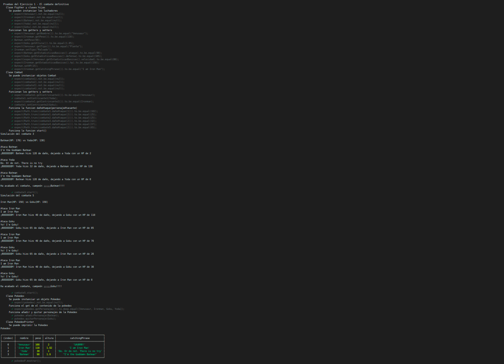
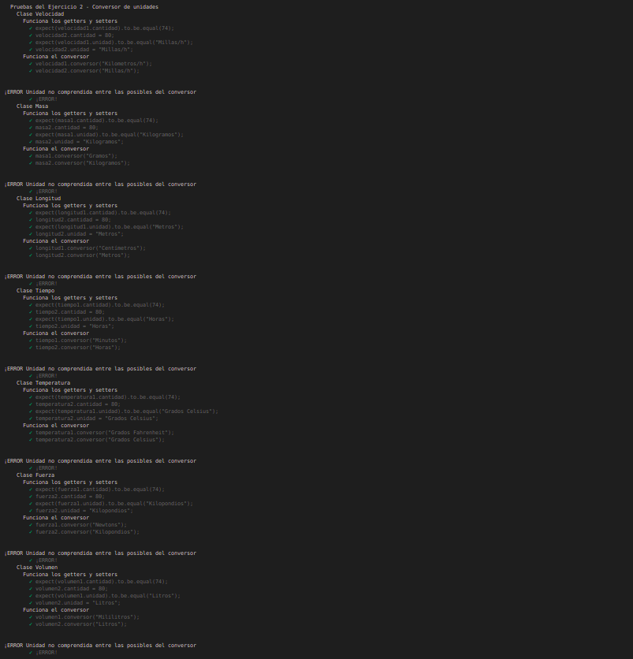
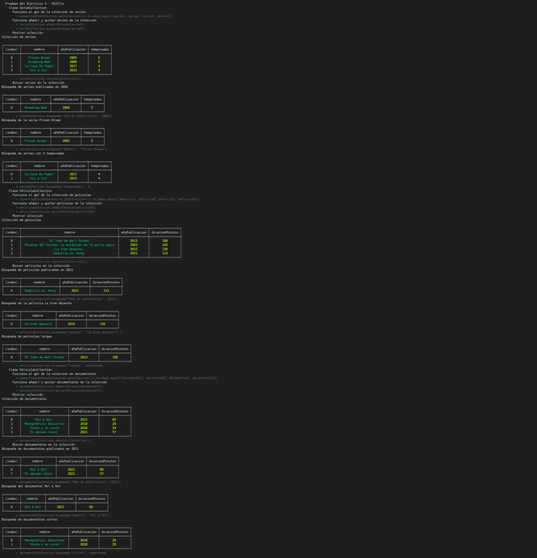

# Informe
## Práctica 6 - Clases e interfaces genéricas. Principios SOLID
### Desarrollo de Sistemas Informáticos
### ACOIDAN MESA HERNANDEZ - alu0101206479@ull.edu.es

#### Introducción
Esto es un informe para poder llevar a cabo la **práctica 6 de Desarrollo de Sistemas Informáticos**, hemos vuelto a crear una estructura de directorios adecuada (algo que ya sabíamos de prácticas anteriores), añadiendole el uso del generador de documentación [TypeDoc](https://typedoc.org/) y el uso de [Mocha](https://mochajs.org/) (Marco de pruebas rico en funciones) con [Chai](https://www.chaijs.com/) (Librería de aserciones BDD / TDD para node y el navegador que se puede combinar con cualquier marco de pruebas JS o TS, en este caso lo hemos configurado con Mocha). También hemos añadido [Instanbul](https://istanbul.js.org/) (Una herramienta que permite obtener informes sobre el cubrimiento del código fuente llevado a cabo por las pruebas que haya diseñado)

A parte, como se ha llevado a cabo la metodología **TDD**, hemos reforzado nuestros conocimientos sobre ello una vez más. Y también hemos aprendido a utilizar **las clases e interfaces genéricas** y a aplicar los **principios SOLID**. En este informe se mostrarán la resolución de los ejercicios y la explicación de estas soluciónes.

También cabe destacar que hemos aprendido a usar los [issues de Github](https://guides.github.com/features/issues/), ya que era por dónde único podríamos comunicarle al profesorado cualquier tipo de incidencia relacionada con la práctica.

#### Objetivos
Los objetivos de esta práctica han sido crear la estructura de directorios adecuada para trabajar, añadiendole el generador de documentación TypeDoc, el uso del marco de pruebas Mocha con la libreria Chai y Instanbul para obtener un informe de cubrimiento de nuestro código cada vez que ejecutasemos las pruebas. Pero lo principal ha sido resolver los 3 ejercicios que nos planteaban en el [enunciado](https://ull-esit-inf-dsi-2021.github.io/prct06-generics-solid/), para así familiarizarnos más profundamente con TypeScript, en concreto con las clases e interfaces genéricas, y con los principios SOLID.

#### Crear la estructura básica y adecuada del proyecto, añadiendole el generador de documentación TypeDoc, el uso del marco de pruebas Mocha con la librería Chai y la herramienta Instanbul.
Para crear la [estructura básica del proyecto](https://ull-esit-inf-dsi-2021.github.io/typescript-theory/typescript-project-setup.html), lo haremos como lo hicimos en prácticas anteriores (Estará el enlace al informe de esta en la bibliografía), también podemos pinchar el hiperenlace adjuntado que se encontrará disponible también en la bibliografía.

Posteriormente, para configurar y aprender a usar el generador de configuración [TypeDoc](https://typedoc.org/) y el marco de pruebas [Mocha](https://mochajs.org/) con la librería [Chai](https://www.chaijs.com/) podremos consultar la documentación o pinchar en los siguientes hiperenlaces a vídeos explicativos (Estos enlaces también se encuentran en la bibliografía):

  * [Vídeo de ejemplo de instalación y configuración de TypeDoc en un proyecto TypeScript](https://drive.google.com/file/d/19LLLCuWg7u0TjjKz9q8ZhOXgbrKtPUme/view)
  * [Vídeo de ejemplo de instalación y configuración de Mocha y Chai en un proyecto TypeScript](https://drive.google.com/file/d/1-z1oNOZP70WBDyhaaUijjHvFtqd6eAmJ/view?usp=sharing)

Después instalaremos Instanbul a través de la siguiente guía:

  * [https://istanbul.js.org/](https://istanbul.js.org/)

Lo instalamos para que en cada ejecución de las pruebas nos salga un informe de cubrimiento de nuestro código, algo como lo siguiente:

Finalmente, nos tiene que quedar algo parecido a lo siguiente (Se muestra a la izquierda la estructura y en el medio algunos archivos abiertos para que se vea su interior):

#### Ejercicios
En cuanto a los ejercicios que se mostrarán a continuación, podemos ver sus respectivos enunciados [en el enunciado de la práctica 6](https://ull-esit-inf-dsi-2021.github.io/prct06-generics-solid/). El código fuente de estos ejercicios deberá estar alojado en un directorio independiente con nombre `ejercicio-n/` dentro del directorio `src/` de nuestro proyecto. Dentro del directorio correspondiente de cada ejercicio debemos incluir cada clase e interfaz desarrollada en un fichero independiente.

Cabe destacar que también se debe aportar la documentación mediante el uso de TypeDoc y usar una metodología de desarrollo dirigido por pruebas/comportamiento. El código fuente de las pruebas deberá estar alojado en un fichero independiente por ejercicio (`ejercicio-n.spec.ts`) dentro del directorio `tests/`.

##### Ejercicio 1 - El combate definitivo
En este ejercicio deberemos crear las siguientes clases:
  * Clase abstracta `Figther`: Es una clase abstracta que permite que un contendiente pueda luchar. Será la clase padre de clases que representan personajes distintos universos que quieran luchar. Su código lo podremos observar en el siguiente enlace:

      [https://github.com/ULL-ESIT-INF-DSI-2021/ull-esit-inf-dsi-20-21-prct06-generics-solid-alu0101206479/blob/master/src/ejercicio-1/figther.ts](https://github.com/ULL-ESIT-INF-DSI-2021/ull-esit-inf-dsi-20-21-prct06-generics-solid-alu0101206479/blob/master/src/ejercicio-1/figther.ts)
      
    Esta clase contendrá los siguientes atributos privados:
      * `nombre`: Nombre del personaje luchador (String) 
      * `peso`: Peso del personaje luchador (Number) 
      * `altura`: Altura del personaje luchador (Number) 
      * `estadisticasBasicas`: Estadisticas básicas (ataque, defensa, velocidad, HP) personaje luchador (Propiedad)  

    Y contendrá las siguientes funciones públicas:
      * `getNombre()`: Función para obtener el atributo privado `nombre`
      * `setNombre(nombre: string)`: Función para cambiar el atributo privado `nombre`
      * `getPeso()`: Función para obtener el atributo privado `peso`
      * `setPeso(peso: number)`: Función para cambiar el atributo privado `peso`
      * `getAltura()`: Función para obtener el atributo privado `altura`
      * `setAltura(altura: number)`: Función para cambiar el atributo privado `altura`
      * `getEstadisticasBasicas()`: Función para obtener el atributo privado `estadisticasBasicas`
      *  `setAtaque(ataque: number)`: Función para cambiar la propiedad `ataque` del atributo privado `estadisticasBasicas`
      *  `setDefensa(defensa: number)`: Función para cambiar la propiedad `defensa` del atributo privado `estadisticasBasicas`
      *  `setVelocidad(velocidad: number)`: Función para cambiar la propiedad `velocidad` del atributo privado `estadisticasBasicas`
      *  `setHP(hp: number)`: Función para cambiar la propiedad `hp` del atributo privado `estadisticasBasicas`
      * `getCatchingPhrase()`: Función para obtener el atributo privado `catchingPhrase`
      * `setCatchingPhrase(catchingPhrase(): string)`: Función para cambiar el atributo privado `catchingPhrase`

  * Clase `Pokemon`: Es una clase que representa un personaje del universo Pokemon, clase hija de la clase `Figther`. Su código lo podremos observar en el siguiente enlace:

      [https://github.com/ULL-ESIT-INF-DSI-2021/ull-esit-inf-dsi-20-21-prct06-generics-solid-alu0101206479/blob/master/src/ejercicio-1/pokemon.ts](https://github.com/ULL-ESIT-INF-DSI-2021/ull-esit-inf-dsi-20-21-prct06-generics-solid-alu0101206479/blob/master/src/ejercicio-1/pokemon.ts)
      
    Esta clase al ser hija de la clase `Figther`, se heredarán en el costructor a través de la función `super` todos los atributos de la clase padre (`nombre`, `peso`, `altura`, `estadisticasBasicas`, `catchingPhrase`). Pero a parte la clase `Pokemon` tambien tendrá el atributo privado:
      * `tipo`: Representará el tipo del Pokemon, puede ser Fuego, Plana, Agua o Eléctrico (String).

    Y contendrá las siguientes funciones públicas:
      * `getTipo()`: Función para obtener el atributo privado `tipo`
      * `setTipo(tipo: string)`: Función para cambiar el atributo privado `tipo`
    

  * Clase `Marvel`: Es una clase que representa un personaje del universo Marvel, clase hija de la clase `Figther`. Su código lo podremos observar en el siguiente enlace:

      [https://github.com/ULL-ESIT-INF-DSI-2021/ull-esit-inf-dsi-20-21-prct06-generics-solid-alu0101206479/blob/master/src/ejercicio-1/marvel.ts](https://github.com/ULL-ESIT-INF-DSI-2021/ull-esit-inf-dsi-20-21-prct06-generics-solid-alu0101206479/blob/master/src/ejercicio-1/marvel.ts)
      
    Esta clase al ser hija de la clase `Figther`, se heredarán en el costructor a través de la función `super` todos los atributos de la clase padre (`nombre`, `peso`, `altura`, `estadisticasBasicas`, `catchingPhrase`). Pero a parte la clase `Marvel` tambien tendrá el atributo privado:
      * `tipo`: Representará el tipo de personaje del personaje Marvel, puede ser malvado o superhéroe ("Malvado" o "Superheroe").

    Y contendrá las siguientes funciones públicas:
      * `getTipo()`: Función para obtener el atributo privado `tipo`
      * `setTipo(tipo: string)`: Función para cambiar el atributo privado `tipo`

  * Clase `DC`: Es una clase que representa un personaje del universo DC Comics, clase hija de la clase `Figther`. Su código lo podremos observar en el siguiente enlace:

      [https://github.com/ULL-ESIT-INF-DSI-2021/ull-esit-inf-dsi-20-21-prct06-generics-solid-alu0101206479/blob/master/src/ejercicio-1/dc.ts](https://github.com/ULL-ESIT-INF-DSI-2021/ull-esit-inf-dsi-20-21-prct06-generics-solid-alu0101206479/blob/master/src/ejercicio-1/dc.ts)
      
    Esta clase al ser hija de la clase `Figther`, se heredarán en el costructor a través de la función `super` todos los atributos de la clase padre (`nombre`, `peso`, `altura`, `estadisticasBasicas`, `catchingPhrase`). Pero a parte la clase `DC` tambien tendrá el atributo privado:
      * `tipo`: Representará el tipo de personaje del personaje DC Comics, puede ser malvado o superhéroe ("Malvado" o "Superheroe").

    Y contendrá las siguientes funciones públicas:
      * `getTipo()`: Función para obtener el atributo privado `tipo`
      * `setTipo(tipo: string)`: Función para cambiar el atributo privado `tipo`

  * Clase `StarWars`: Es una clase que representa un personaje del universo Star Wars, clase hija de la clase `Figther`. Su código lo podremos observar en el siguiente enlace:

      [https://github.com/ULL-ESIT-INF-DSI-2021/ull-esit-inf-dsi-20-21-prct06-generics-solid-alu0101206479/blob/master/src/ejercicio-1/starwars.ts](https://github.com/ULL-ESIT-INF-DSI-2021/ull-esit-inf-dsi-20-21-prct06-generics-solid-alu0101206479/blob/master/src/ejercicio-1/starwars.ts)
      
    Esta clase al ser hija de la clase `Figther`, se heredarán en el costructor a través de la función `super` todos los atributos de la clase padre (`nombre`, `peso`, `altura`, `estadisticasBasicas`, `catchingPhrase`). Pero a parte la clase `StarWars` tambien tendrá el atributo privado:
      * `colorSable`: Representará el color del sable del personaje de Star Wars, puede ser azul, rojo o verde ("Azul" o "Rojo" o "Verde").

    Y contendrá las siguientes funciones públicas:
      * `getColorSable()`: Función para obtener el atributo privado `colorSable`
      * `setColorSable(colorSable: string)`: Función para cambiar el atributo privado `colorSable`

  * Clase `DragonBall`: Es una clase que representa un personaje del universo Dragon Ball, clase hija de la clase `Figther`. Su código lo podremos observar en el siguiente enlace:

      [https://github.com/ULL-ESIT-INF-DSI-2021/ull-esit-inf-dsi-20-21-prct06-generics-solid-alu0101206479/blob/master/src/ejercicio-1/dragonball.ts](https://github.com/ULL-ESIT-INF-DSI-2021/ull-esit-inf-dsi-20-21-prct06-generics-solid-alu0101206479/blob/master/src/ejercicio-1/dragonball.ts)
      
    Esta clase al ser hija de la clase `Figther`, se heredarán en el costructor a través de la función `super` todos los atributos de la clase padre (`nombre`, `peso`, `altura`, `estadisticasBasicas`, `catchingPhrase`). Pero a parte la clase `DragonBall` tambien tendrá el atributo privado:
      * `ki`: Representará el Ki (Nivel de poder) del personaje de Dragon Ball (Number).

    Y contendrá las siguientes funciones públicas:
      * `getKi()`: Función para obtener el atributo privado `ki`
      * `setKi(ki: string)`: Función para cambiar el atributo privado `ki`

  * Clase `Combat`: Es la clase que representa un combate entre personajes de distintos universos, su código lo podremos observar en el siguiente enlace:

      [https://github.com/ULL-ESIT-INF-DSI-2021/ull-esit-inf-dsi-20-21-prct06-generics-solid-alu0101206479/blob/master/src/ejercicio-1/combat.ts](https://github.com/ULL-ESIT-INF-DSI-2021/ull-esit-inf-dsi-20-21-prct06-generics-solid-alu0101206479/blob/master/src/ejercicio-1/combat.ts)
      
    Esta clase contendrá los siguientes atributos privados:
      * `contrincante1`: Pokemon 1 del combate (Figther)
      * `contrincante2`: Pokemon 2 del combate (Fither)

    Y contendrá las siguientes funciones públicas:
      * `getContrincante1()`: Función para obtener el atributo privado `contrincante1`
      * `setContrincante1()`: Función para cambiar el atributo privado `contrincante1`
      * `getContrincante2()`: Función para obtener el atributo privado `contrincante2`
      * `setContrincante2()`: Función para cambiar el atributo privado `contrincante2`
      * `dañoAtaque(personajeAtacante: number): number`: Función que calcula a través de diversos `switch` y condicionales el daño que causa un personaje a otro y lo devuelve, le entra como parámetro un número que indica si ataca el contrincante 1 o el contrincante 2.
      * `start()`: Función que muestra por pantalla la simulación del combate (También se muestran la catching phrase de los personajes cada vez que atacan), esto se hace a través de un bucle `while` que se va a ejecutar hasta que a uno de los dos Pokemons del combate se le acabe el hp (Primero ataca un Pokemon y después el otro).

  * Clase `Pokedex`: Es la clase que representa a la Pokedex (Registro de todos los personajes), su código lo podremos observar en el siguiente enlace:

      [https://github.com/ULL-ESIT-INF-DSI-2021/ull-esit-inf-dsi-20-21-prct06-generics-solid-alu0101206479/blob/master/src/ejercicio-1/pokedex.ts](https://github.com/ULL-ESIT-INF-DSI-2021/ull-esit-inf-dsi-20-21-prct06-generics-solid-alu0101206479/blob/master/src/ejercicio-1/pokedex.ts)
      
    Esta clase contendrá el siguiente atributo privado
      * `personajes`: Todos los personajes que tendrá la Pokédex ((Pokemon o Marvel o DC o StarWars o DragonBall)[])

    Y contendrá las siguientes funciones públicas:
      * `getPersonajes()`: Función para obtener el atributo privado `personajes`
      * `añadirPersonaje(personaje: (Pokemon | Marvel | DC | StarWars | DragonBall))`: Función para añadir un personaje a la Pokedex (se añade con `push(personaje)` un personaje al atributo `personajes`.
      * `quitarPersonaje(personaje: (Pokemon | Marvel | DC | StarWars | DragonBall))`: Función para quitar un personaje de la Pokedex (se quita un personaje del atributo `personajes`).

  * Clase `PokedexPrinter`: Es una clase que servirá para imprimir una Pokédex, esta clase se hizo para cumplir el **principio S (Single responsibility principle) de los principios SOLID** y no asignarle varias responsabilidades a la clase `Pokedex`. Su código lo podremos observar en el siguiente enlace:

      [https://github.com/ULL-ESIT-INF-DSI-2021/ull-esit-inf-dsi-20-21-prct06-generics-solid-alu0101206479/blob/master/src/ejercicio-1/pokedex.ts](https://github.com/ULL-ESIT-INF-DSI-2021/ull-esit-inf-dsi-20-21-prct06-generics-solid-alu0101206479/blob/master/src/ejercicio-1/pokedex.ts)
      
    Esta clase contendrá el siguiente atributo privado:
      * `pokedex`: Pokedex que se imprimirá (Pokedex)

    Y contendrá las siguiente funcion pública:
      * `mostrar()`: Función que muestra en una tabla los personajes de la Pokedex

Las pruebas de este ejercicio se pueden observar en el siguiente enlace:

  [https://github.com/ULL-ESIT-INF-DSI-2021/ull-esit-inf-dsi-20-21-prct06-generics-solid-alu0101206479/blob/master/tests/ejercicio-1.spec.ts](https://github.com/ULL-ESIT-INF-DSI-2021/ull-esit-inf-dsi-20-21-prct06-generics-solid-alu0101206479/blob/master/tests/ejercicio-1.spec.ts)
  
Y la salida de estas pruebas al ejecutar `npm run test` debería ser la siguiente:

  
  
  
  
##### Ejercicio 2 - Conversor de unidades
En este ejercicio deberemos de crear las siguientes clases e interfaces:
  * Interfaz genérica `isConvertible`: Interfaz genérica que sirve para describir la forma de una magnitud entre la que se puede hacer conversión entre unidades, su código lo podemos observar en el siguiente enlace:

      [https://github.com/ULL-ESIT-INF-DSI-2021/ull-esit-inf-dsi-20-21-prct06-generics-solid-alu0101206479/blob/master/src/ejercicio-2/isconvertible.ts](https://github.com/ULL-ESIT-INF-DSI-2021/ull-esit-inf-dsi-20-21-prct06-generics-solid-alu0101206479/blob/master/src/ejercicio-2/isconvertible.ts)
      
    Esta interfaz contendrá los siguientes atributos:
      * `cantidad`: Cantidad de la unidad de la magnitud (Number)
      * `unidad`: Unidad de la magnitud (T)

    Y contendrá la función:
      * `conversor(uResultado: T)`: Función que servirá para convertir de la unidad `unidad` a la unidad `uResultado`

  * Clase `Velocidad`: Clase que representa una medida de velocidad y a través de la cual se puede hacer la conversión entre unidades de velocidad, esta clase implementa la interfaz `isConvertible<string>`. Su código lo podemos observar en el siguiente enlace:

      [https://github.com/ULL-ESIT-INF-DSI-2021/ull-esit-inf-dsi-20-21-prct06-generics-solid-alu0101206479/blob/master/src/ejercicio-2/velocidad.ts](https://github.com/ULL-ESIT-INF-DSI-2021/ull-esit-inf-dsi-20-21-prct06-generics-solid-alu0101206479/blob/master/src/ejercicio-2/velocidad.ts)
      
    Esta clase contendrá los siguientes atributos públicos (extraídos de la interfaz):
      * `cantidad`: Cantidad de velocidad (Number)
      * `unidad`: Unidad en la que esta medida la velocidad (String)

    Y contendrá las siguiente funcion (extraída de la interfaz):
      * `conversor(uResultado: string)`: Función que realiza la conversión entre unidades de velocidad y se le pasa como parámetro la unidad a la que se quiere llegar (Se puede convertir de Millas/h a Kilometros/h o de Kilometros/h a Millas/h). También cabe destacar que si se pasa por parámetro otra unidad que no sean las mencionadas, se mostrará un error por pantalla y no se hará la conversión.

  * Clase `Masa`: Clase que representa una medida de masa y a través de la cual se puede hacer la conversión entre unidades de masa, esta clase implementa la interfaz `isConvertible<string>`. Su código lo podemos observar en el siguiente enlace:

      [https://github.com/ULL-ESIT-INF-DSI-2021/ull-esit-inf-dsi-20-21-prct06-generics-solid-alu0101206479/blob/master/src/ejercicio-2/masa.ts](https://github.com/ULL-ESIT-INF-DSI-2021/ull-esit-inf-dsi-20-21-prct06-generics-solid-alu0101206479/blob/master/src/ejercicio-2/masa.ts)
      
    Esta clase contendrá los siguientes atributos públicos (extraídos de la interfaz):
      * `cantidad`: Cantidad de masa (Number)
      * `unidad`: Unidad en la que esta medida la masa (String)

    Y contendrá las siguiente funcion (extraída de la interfaz):
      * `conversor(uResultado: string)`: Función que realiza la conversión entre unidades de masa y se le pasa como parámetro la unidad a la que se quiere llegar (Se puede convertir de Kilogramos a Gramos o de Gramos a Kilogramos). También cabe destacar que si se intenta hacer la conversión entre otras unidades que no sean las mencionadas, se mostrará un error por pantalla y no se hará la conversión.

  * Clase `Longitud`: Clase que representa una medida de longitud y a través de la cual se puede hacer la conversión entre unidades de longitud, esta clase implementa la interfaz `isConvertible<string>`. Su código lo podemos observar en el siguiente enlace:

      [https://github.com/ULL-ESIT-INF-DSI-2021/ull-esit-inf-dsi-20-21-prct06-generics-solid-alu0101206479/blob/master/src/ejercicio-2/longitud.ts](https://github.com/ULL-ESIT-INF-DSI-2021/ull-esit-inf-dsi-20-21-prct06-generics-solid-alu0101206479/blob/master/src/ejercicio-2/longitud.ts)
      
    Esta clase contendrá los siguientes atributos públicos (extraídos de la interfaz):
      * `cantidad`: Cantidad de longitud (Number)
      * `unidad`: Unidad en la que esta medida la longitud (String)

    Y contendrá las siguiente funcion (extraída de la interfaz):
      * `conversor(uResultado: string)`: Función que realiza la conversión entre unidades de longitud y se le pasa como parámetro la unidad a la que se quiere llegar (Se puede convertir de Metros a Centímetros o de Centímetros a Metros). También cabe destacar que si se intenta hacer la conversión entre otras unidades que no sean las mencionadas, se mostrará un error por pantalla y no se hará la conversión.

  * Clase `Tiempo`: Clase que representa una medida de tiempo y a través de la cual se puede hacer la conversión entre unidades de tiempo, esta clase implementa la interfaz `isConvertible<string>`. Su código lo podemos observar en el siguiente enlace:

      [https://github.com/ULL-ESIT-INF-DSI-2021/ull-esit-inf-dsi-20-21-prct06-generics-solid-alu0101206479/blob/master/src/ejercicio-2/tiempo.ts](https://github.com/ULL-ESIT-INF-DSI-2021/ull-esit-inf-dsi-20-21-prct06-generics-solid-alu0101206479/blob/master/src/ejercicio-2/tiempo.ts)
      
    Esta clase contendrá los siguientes atributos públicos (extraídos de la interfaz):
      * `cantidad`: Cantidad de tiempo (Number)
      * `unidad`: Unidad en la que esta medido el tiempo (String)

    Y contendrá las siguiente funcion (extraída de la interfaz):
      * `conversor(uResultado: string)`: Función que realiza la conversión entre unidades de tiempo y se le pasa como parámetro la unidad a la que se quiere llegar (Se puede convertir de Horas a Minutos o de Minutos a Horas). También cabe destacar que si se intenta hacer la conversión entre otras unidades que no sean las mencionadas, se mostrará un error por pantalla y no se hará la conversión.

  * Clase `Temperatura`: Clase que representa una medida de temperatura y a través de la cual se puede hacer la conversión entre unidades de temperatura, esta clase implementa la interfaz `isConvertible<string>`. Su código lo podemos observar en el siguiente enlace:

      [https://github.com/ULL-ESIT-INF-DSI-2021/ull-esit-inf-dsi-20-21-prct06-generics-solid-alu0101206479/blob/master/src/ejercicio-2/temperatura.ts](https://github.com/ULL-ESIT-INF-DSI-2021/ull-esit-inf-dsi-20-21-prct06-generics-solid-alu0101206479/blob/master/src/ejercicio-2/temperatura.ts)
      
    Esta clase contendrá los siguientes atributos públicos (extraídos de la interfaz):
      * `cantidad`: Cantidad de temperatura (Number)
      * `unidad`: Unidad en la que esta medida la temperatura (String)

    Y contendrá las siguiente funcion (extraída de la interfaz):
      * `conversor(uResultado: string)`: Función que realiza la conversión entre unidades de temperatura y se le pasa como parámetro la unidad a la que se quiere llegar (Se puede convertir de Grados Celsius a Grados Fahrenheit o de Grados Fahrenheit a Grados Celsius). También cabe destacar que si se intenta hacer la conversión entre otras unidades que no sean las mencionadas, se mostrará un error por pantalla y no se hará la conversión.

  * Clase `Fuerza`: Clase que representa una medida de fuerza y a través de la cual se puede hacer la conversión entre unidades de fuerza, esta clase implementa la interfaz `isConvertible<string>`. Su código lo podemos observar en el siguiente enlace:

      [https://github.com/ULL-ESIT-INF-DSI-2021/ull-esit-inf-dsi-20-21-prct06-generics-solid-alu0101206479/blob/master/src/ejercicio-2/fuerza.ts](https://github.com/ULL-ESIT-INF-DSI-2021/ull-esit-inf-dsi-20-21-prct06-generics-solid-alu0101206479/blob/master/src/ejercicio-2/fuerza.ts)
      
    Esta clase contendrá los siguientes atributos públicos (extraídos de la interfaz):
      * `cantidad`: Cantidad de fuerza (Number)
      * `unidad`: Unidad en la que esta medida la fuerza (String)

    Y contendrá las siguiente funcion (extraída de la interfaz):
      * `conversor(uResultado: string)`: Función que realiza la conversión entre unidades de fuerza y se le pasa como parámetro la unidad a la que se quiere llegar (Se puede convertir de Kilopondios a Newtons o de Newtons a Kilopondios). También cabe destacar que si se intenta hacer la conversión entre otras unidades que no sean las mencionadas, se mostrará un error por pantalla y no se hará la conversión.

  * Clase `Volumen`: Clase que representa una medida de volumen y a través de la cual se puede hacer la conversión entre unidades de volumen, esta clase implementa la interfaz `isConvertible<string>`. Su código lo podemos observar en el siguiente enlace:

      [https://github.com/ULL-ESIT-INF-DSI-2021/ull-esit-inf-dsi-20-21-prct06-generics-solid-alu0101206479/blob/master/src/ejercicio-2/volumen.ts](https://github.com/ULL-ESIT-INF-DSI-2021/ull-esit-inf-dsi-20-21-prct06-generics-solid-alu0101206479/blob/master/src/ejercicio-2/volumen.ts)
      
    Esta clase contendrá los siguientes atributos públicos (extraídos de la interfaz):
      * `cantidad`: Cantidad de volumen (Number)
      * `unidad`: Unidad en la que esta medido el volumen (String)

    Y contendrá las siguiente funcion (extraída de la interfaz):
      * `conversor(uResultado: string)`: Función que realiza la conversión entre unidades de volumen y se le pasa como parámetro la unidad a la que se quiere llegar (Se puede convertir de Litros a Mililitros o de Mililitros a Litros). También cabe destacar que si se intenta hacer la conversión entre otras unidades que no sean las mencionadas, se mostrará un error por pantalla y no se hará la conversión.

Las pruebas de este ejercicio se pueden observar en el siguiente enlace:

  [https://github.com/ULL-ESIT-INF-DSI-2021/ull-esit-inf-dsi-20-21-prct06-generics-solid-alu0101206479/blob/master/tests/ejercicio-2.spec.ts](https://github.com/ULL-ESIT-INF-DSI-2021/ull-esit-inf-dsi-20-21-prct06-generics-solid-alu0101206479/blob/master/tests/ejercicio-2.spec.ts)
  
Y la salida de estas pruebas al ejecutar `npm run test` debería ser la siguiente:

  

##### Ejercicio 3 - DSIflix
En este ejercicio deberemos de crear las siguientes clases, interfaces y tipos:
  * Interfaz genérica `Streamable`: Interfaz que sirve para especificar las propiedades y los métodos de una colección de emisiones concreta, su código lo podemos observar en el siguiente enlace:

      [https://github.com/ULL-ESIT-INF-DSI-2021/ull-esit-inf-dsi-20-21-prct06-generics-solid-alu0101206479/blob/master/src/ejercicio-3/streamable.ts](https://github.com/ULL-ESIT-INF-DSI-2021/ull-esit-inf-dsi-20-21-prct06-generics-solid-alu0101206479/blob/master/src/ejercicio-3/streamable.ts)
      
    Esta interfaz contendrá el siguiente atributo:
      * `colección`: Atributo que almacenará todas las emisiones de la colección (T[])

    Y contendrá las funciónes:
      * `getColeccion()`: Función para obtener el atributo `coleccion`
      * `añadirEmision(emision: T)`: Función para añadir una emision a la colección
      * `quitarEmision(emision: T)`: Función para quitar una emisión de la colección

  * Interfaz genérica `busquedaStreamable`: Es una interfaz que sirve para definir el método para hacer la busqueda de elementos en una colección, esta interfaz se hizo para cumplir el **principio I (Interface segregation) de los principios SOLID** y no hacer tan compleja la interfaz `Streamable`. Su código lo podremos observar en el siguiente enlace:

      [https://github.com/ULL-ESIT-INF-DSI-2021/ull-esit-inf-dsi-20-21-prct06-generics-solid-alu0101206479/blob/master/src/ejercicio-3/busquedastreamable.ts](https://github.com/ULL-ESIT-INF-DSI-2021/ull-esit-inf-dsi-20-21-prct06-generics-solid-alu0101206479/blob/master/src/ejercicio-3/busquedastreamable.ts)
      
    Esta interfaz contendrá la función:
      * `busqueda(atributo: string, valor: string | number)`: Función para buscar emisiones concretas el atributo `coleccion` a través de algo en concreto.

  * Interfaz `imprimirStreamable`: Es una interfaz que sirve para definir el método para imprimir los elementos de una colección, esta interfaz se hizo para cumplir el **principio I (Interface segregation) de los principios SOLID** y no hacer tan compleja la interfaz `Streamable`. Su código lo podremos observar en el siguiente enlace:

      [https://github.com/ULL-ESIT-INF-DSI-2021/ull-esit-inf-dsi-20-21-prct06-generics-solid-alu0101206479/blob/master/src/ejercicio-3/imprimirstreamable.ts](https://github.com/ULL-ESIT-INF-DSI-2021/ull-esit-inf-dsi-20-21-prct06-generics-solid-alu0101206479/blob/master/src/ejercicio-3/imprimirstreamable.ts)
      
    Esta interfaz contendrá la función:
      * `imprimirColeccion()`: Función para imprimir los elementos de la colección.

  * Clase abstracta genérica `BasicStreamableCollection`: Es una clase abstracta genérica que implementa y desarrolla las interfaces `Streamable`, `busquedaStreamable` y `imiprimirStreamable`. Esta clase será padre de las clases que quieran representar una colección de emisiones concreta. Su código lo podremos observar en el siguiente enlace:

      [https://github.com/ULL-ESIT-INF-DSI-2021/ull-esit-inf-dsi-20-21-prct06-generics-solid-alu0101206479/blob/master/src/ejercicio-3/basicstreamablecollection.ts](https://github.com/ULL-ESIT-INF-DSI-2021/ull-esit-inf-dsi-20-21-prct06-generics-solid-alu0101206479/blob/master/src/ejercicio-3/basicstreamablecollection.ts)
      
    Esta clase contendrá el siguiente atributo (extraido de la interfaz `Streamable`):
      * `colección`: Atributo que almacenará todas las emisiones de la colección (T[])

    Y contendrá las siguientes funciones (extraidas de las interfaces `Streamable`, `busquedaStreamable` y `imprimirStreamable`:
      * `añadirEmision(emision: T)`: Función para añadir una emision a la colección
      * `quitarEmision(emision: T)`: Función para quitar una emisión de la colección
      * `abstract getColeccion()`: Función abstracta que cuando se desarrolle retornará  el atributo coleccion
      * `abstract busqueda(atributo: string, valor: string | number)`: Función abstracta que sirve para buscar emisiones concreta según el criterio elegido, dentro de la colección
      * `imprimirColeccion()`: Función que muestra en una tabla las emisiones de la colección

  * Tipo `serie`: Es un tipo que representa una serie. Su código lo podremos observar en el siguiente enlace:

      [https://github.com/ULL-ESIT-INF-DSI-2021/ull-esit-inf-dsi-20-21-prct06-generics-solid-alu0101206479/blob/master/src/ejercicio-3/seriecollection.ts](https://github.com/ULL-ESIT-INF-DSI-2021/ull-esit-inf-dsi-20-21-prct06-generics-solid-alu0101206479/blob/master/src/ejercicio-3/seriecollection.ts)
      
    Este tipo contendrá las propiedades:
      * `nombre`: Nombre de la serie (String)
      * `añoPublicacion`: Año de publicación de la serie (Number)
      * `temporadas`: Temporadas de la serie (Number)

  * Clase `SerieCollection`: Es una clase que representa una colección de series, clase hija de la clase `BasicStreamableCollection`. Su código lo podremos observar en el siguiente enlace:

      [https://github.com/ULL-ESIT-INF-DSI-2021/ull-esit-inf-dsi-20-21-prct06-generics-solid-alu0101206479/blob/master/src/ejercicio-3/seriecollection.ts](https://github.com/ULL-ESIT-INF-DSI-2021/ull-esit-inf-dsi-20-21-prct06-generics-solid-alu0101206479/blob/master/src/ejercicio-3/seriecollection.ts)
      
    Esta clase al ser hija de la clase `BasicStreamableCollection`, se heredará en el costructor a través de la función `super` el atributo de la clase padre (`coleccion`).
    
    Cabe destacar que en esta clase desarrollaremos las funciones abstractas de la clase padre, que son las siguientes:
      * `getColeccion()`: Funcion que retorna el atributo `coleccion`
      * `busqueda(atributo: string, valor: string | number)`: Función para buscar series concretas en la colección a través del nombre, el año de publicación o el número de temporadas. Esto se hace con un bucle `forEach` que recorre la colección y diversos condicionales. Finalmente se muestra en una tabla el resultado de la búsqueda y lo retorna.

  * Tipo `pelicula`: Es un tipo que representa una pelicula. Su código lo podremos observar en el siguiente enlace:

      [https://github.com/ULL-ESIT-INF-DSI-2021/ull-esit-inf-dsi-20-21-prct06-generics-solid-alu0101206479/blob/master/src/ejercicio-3/peliculacollection.ts](https://github.com/ULL-ESIT-INF-DSI-2021/ull-esit-inf-dsi-20-21-prct06-generics-solid-alu0101206479/blob/master/src/ejercicio-3/peliculacollection.ts)
      
    Este tipo contendrá las propiedades:
      * `nombre`: Nombre de la pelicula (String)
      * `añoPublicacion`: Año de publicación de la pelicula (Number)
      * `duracionMinutos`: Duración en minutos de la película (Number)

  * Clase `PeliculaCollection`: Es una clase que representa una colección de peliculas, clase hija de la clase `BasicStreamableCollection`. Su código lo podremos observar en el siguiente enlace:

      [https://github.com/ULL-ESIT-INF-DSI-2021/ull-esit-inf-dsi-20-21-prct06-generics-solid-alu0101206479/blob/master/src/ejercicio-3/peliculacollection.ts](https://github.com/ULL-ESIT-INF-DSI-2021/ull-esit-inf-dsi-20-21-prct06-generics-solid-alu0101206479/blob/master/src/ejercicio-3/peliculacollection.ts)
      
    Esta clase al ser hija de la clase `BasicStreamableCollection`, se heredará en el costructor a través de la función `super` el atributo de la clase padre (`coleccion`).
    
    Cabe destacar que en esta clase desarrollaremos las funciones abstractas de la clase padre, que son las siguientes:
      * `getColeccion()`: Funcion que retorna el atributo `coleccion`
      * `busqueda(atributo: string, valor: string | number)`: Función para buscar peliculas concretas en la colección a través del nombre, el año de publicación o la duración. Esto se hace con un bucle `forEach` que recorre la colección y diversos condicionales. Finalmente se muestra en una tabla el resultado de la búsqueda y lo retorna.

  * Tipo `documental`: Es un tipo que representa un documental. Su código lo podremos observar en el siguiente enlace:

      [https://github.com/ULL-ESIT-INF-DSI-2021/ull-esit-inf-dsi-20-21-prct06-generics-solid-alu0101206479/blob/master/src/ejercicio-3/documentalcollection.ts](https://github.com/ULL-ESIT-INF-DSI-2021/ull-esit-inf-dsi-20-21-prct06-generics-solid-alu0101206479/blob/master/src/ejercicio-3/documentalcollection.ts)
      
    Este tipo contendrá las propiedades:
      * `nombre`: Nombre de la pelicula (String)
      * `añoPublicacion`: Año de publicación de la pelicula (Number)
      * `duracionMinutos`: Duración en minutos de la película (Number)

  * Clase `DocumentalCollection`: Es una clase que representa una colección de documentales, clase hija de la clase `BasicStreamableCollection`. Su código lo podremos observar en el siguiente enlace:

      [https://github.com/ULL-ESIT-INF-DSI-2021/ull-esit-inf-dsi-20-21-prct06-generics-solid-alu0101206479/blob/master/src/ejercicio-3/documentalcollection.ts](https://github.com/ULL-ESIT-INF-DSI-2021/ull-esit-inf-dsi-20-21-prct06-generics-solid-alu0101206479/blob/master/src/ejercicio-3/documentalcollection.ts)
      
    Esta clase al ser hija de la clase `BasicStreamableCollection`, se heredará en el costructor a través de la función `super` el atributo de la clase padre (`coleccion`).
    
    Cabe destacar que en esta clase desarrollaremos las funciones abstractas de la clase padre, que son las siguientes:
      * `getColeccion()`: Funcion que retorna el atributo `coleccion`
      * `busqueda(atributo: string, valor: string | number)`: Función para buscar documentales concretos en la colección a través del nombre, el año de publicación o la duración. Esto se hace con un bucle `forEach` que recorre la colección y diversos condicionales. Finalmente se muestra en una tabla el resultado de la búsqueda y lo retorna.

Las pruebas de este ejercicio se pueden observar en el siguiente enlace:

  [https://github.com/ULL-ESIT-INF-DSI-2021/ull-esit-inf-dsi-20-21-prct06-generics-solid-alu0101206479/blob/master/tests/ejercicio-3.spec.ts](https://github.com/ULL-ESIT-INF-DSI-2021/ull-esit-inf-dsi-20-21-prct06-generics-solid-alu0101206479/blob/master/tests/ejercicio-3.spec.ts)
  
Y la salida de estas pruebas al ejecutar `npm run test` debería ser la siguiente:

  
  
  

#### Conclusiones
Como conclusión a la práctica, me ha parecido bastante interesante retomar el uso de "Plantillas" con las clases e interfaces genéricas, ya que lo aprendí en C++ y considero que es algo bastante complejo de entender. Pero creo que lo he hecho todo correctamente y con paciencia, ya que ha sido una práctica bastante larga.

Poco a poco viendo diversos artículos me voy dando cuenta de que TypeScript es muy útil en la actualidad y me alegra mucho aprender a usarlo cada vez más.

#### Bibliografía

Nombre | Enlaces
-------|--------
Enunciado de la práctica | [https://ull-esit-inf-dsi-2021.github.io/prct06-generics-solid/](https://ull-esit-inf-dsi-2021.github.io/prct06-generics-solid/)
Apuntes de la asignatura | [https://ull-esit-inf-dsi-2021.github.io/typescript-theory/](https://ull-esit-inf-dsi-2021.github.io/typescript-theory/)
TypeDoc | [https://typedoc.org/](https://typedoc.org/)
Mocha | [https://mochajs.org/](https://mochajs.org/)
Chai | [https://www.chaijs.com/](https://www.chaijs.com/)
Tutorial de creación de la estructura básica del proyecto | [https://ull-esit-inf-dsi-2021.github.io/typescript-theory/typescript-project-setup.html](https://ull-esit-inf-dsi-2021.github.io/typescript-theory/typescript-project-setup.html)
Vídeo de ejemplo de instalación y configuración de TypeDoc en un proyecto TypeScript | [https://drive.google.com/file/d/19LLLCuWg7u0TjjKz9q8ZhOXgbrKtPUme/view](https://drive.google.com/file/d/19LLLCuWg7u0TjjKz9q8ZhOXgbrKtPUme/view)
Repositorio GitHub con el ejemplo de configuración de TypeDoc en un proyecto TypeScript | [https://github.com/ULL-ESIT-INF-DSI-2021/doc-test](https://github.com/ULL-ESIT-INF-DSI-2021/doc-test)
Vídeo de ejemplo de instalación y configuración de Mocha y Chai en un proyecto TypeScript | [https://drive.google.com/file/d/1-z1oNOZP70WBDyhaaUijjHvFtqd6eAmJ/view](https://drive.google.com/file/d/1-z1oNOZP70WBDyhaaUijjHvFtqd6eAmJ/view)
Repositorio GitHub con el ejemplo de configuración de Mocha y Chai en un proyecto TypeScript | [https://github.com/ULL-ESIT-INF-DSI-2021/doc-test](https://github.com/ULL-ESIT-INF-DSI-2021/doc-test)
Instanbul | [https://istanbul.js.org/](https://istanbul.js.org/)
Issues de Github | [https://guides.github.com/features/issues/](https://guides.github.com/features/issues/)
Práctica 5 | [https://ull-esit-inf-dsi-2021.github.io/prct05-objects-classes-interfaces/](https://ull-esit-inf-dsi-2021.github.io/prct05-objects-classes-interfaces/)
